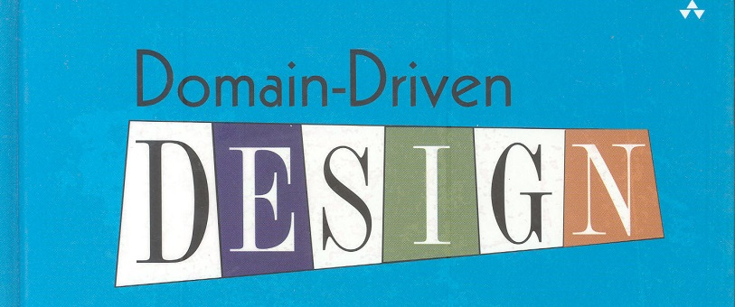

# Types-ddd

Documentation is being written

**Install:** `npm i types-ddd` or `yarn add types-ddd`

[Full documentation on gitbook.io/types-ddd/](https://alessandroadm.gitbook.io/types-ddd/) or check example folder o source code [Github example](https://github.com/4lessandrodev/types-ddd/tree/main/example)

### Test v1.0.0 on playground

V1.0.0 are available on the playground
[Click - Playground](https://www.typescriptlang.org/play?#code/PTAEFpK6dh1AggJQHIC5QBUASBJAyqAVgJoAKAovuACJ2gAyuAQqAGoVL64DyKoARgB0ABlGwJkyAFgAUCAhSlyyKADiAe1AAXLQBsAlgDsApqACsAdkUrbSuXOPaTAJwBmAQwDGZth70AriY8AEYAViZe2mQuGgAOAM6gAN5yoOnpANrGACYmAB4YCdouxgDmALoYHkYAngDccgC+DrIeIcUu3tqgXnoeCUl+gcHhkdoAPJigBc5GOUP+QaERUTHxCQB8KWkZoHGxzlEmOfuxiRiYjbK7GV4aRp0BURouABQHG5cAlDuyewDeg9iqAQgMTOsLqAarVQABeP6ApHpISoz6JAA0tyRTWu2MB2gAFgYEkJ0UkEWCEhDzglrgCWjd-ns4gEQoYvDMAI4BfwJN4ANyWo1W2gA-BhhssxlEpptvhgQhoNHoTDVEcjQAY3KBBcKVuN4XCEUYAno9KAAD6W0BCkYGqJGhEBeYmNzGE6-VLMzV7FwmbQBFxGUCePTU+maxm+7W6u3S0Vk2lO0AuvLu0w5L3433+wPB0N8kyR5HRzV5oMht45zUAKXwfCEnXK2tqbyJJKTG1+xoR9cbzaMZVbevtMu0XcS3xrGW+JfSjMZcj6AySSBMCTNk0w229ANZ7IMnJJ+GePkGiuVqpq8-2bI5WoSADEPAZAv7Lyq1UZbweH65YhcS4rVAQcyl-UohWcUAAH14xMS48R9dI-yPIFHhKZ5dHeGd0hPM8NwST9ryMLFkMBADXglLAQLAkDTXNMjfXg6jMCYvZs3IgFYzefCvHPJIADJBJmFxAM430ASJWIAHdQFMOSKDE15qy4ySMgAclwIw7QMHIeDiVwPG0AwHgwBBQH9Tc9B6LwaiMDQehCMxN34wi3DNaF5nQ7RXxDdVKJcDT2PU0A51w0Ay2RHiAEI+IE0BhNAGLAok0KdEJWT5JMRTlJwtTQq0nT-D0gyjJMszQAszw33KSyNy3bKTiSXQfL8rzRMA0AAFtCI8MoTGCiKAXCgqF1aX0O1JeLCPhR9TzcwZbyk4lpufV93zMBE4oSBaBOWvYpqEQK5pOgYsAOjIjrg4U5vg6EkiuCbNQdCc3H9EwAC8THbVbRoZZ6MlQzkBu0ddrO0N4FRovdNVio6ZsGNLQvuR4vyEPQNDKX7O1Sy6kWkjQ5IU0AlMA1T0sBDSAGF1QcnpQYysx7o0HUAry+qIaEUAAFVqU614pTMYxijVHIhCGsbAX+qNAaRCsC2u+DbyXcjgYFlwhah4DYeRBWQyOs7HpVuW70PTlimMtCNAAawmHnNlHIJqJ56Hwa3e3dwi-Xsrk92bM99sXCCDF5LNPRQ-gmWMlV-d7zQy2TM5Gq9EDwKihKco3YagOHY1PWA0rX3QH9yYHbeMNqVDvH8Vjll44t3yk6BbqQg9N4rK3IiS5zyYYU2TIKmziGJn7-OkTcV5dVRkFO5s0BWc5rvkfUni54nEkXzfIMTF+H31-xyLvcLgtS6EW2oZN2RVfaTpul6fpBlAZhwRoDRur8igjBM7RYV19IZ6YRePlX06svD+mMicBA4oMA0EgSFJE6sAhxByJAnI0DqJwOcAgwE6sSQ0BMKqZwORqJKi-DUHBcdzagDyEQqBMDQBYJMDgleBJVpCHAWqYh0C5qcLQTwsUYpi5MMvhFI6yDUHcJ6M6FB-CeiCOEZA0RUsEYJAIXQ04CJ8GEIDCcUACjK7FjEew2huj0HSMfOosx+iaE6KkaADAaY3QehyFfVWK4n64DyN-bUBhXBynHuhJ4wCPiQUgbaYUPxAkrU7PdBEyta6mxMDyPkvESEYC8SYHx7p-E7mhmQki0S9g8T0imBiFprRak0caVMroMyeiKQXfMIZDGHyikiWKaStQYRqD4ReR1AHB2Ad8VhuYT4tKLG04+zSqlCF0FrHsNSjoJPInXK6Gh8CZyHFDRp6QfabNKNs5Zwpo7jSZFJDQCydbTKLsckYbjWgeKSDzIwBgeQmC-j-WouAaAzHyHMBYRBvEmRyS4CYdEbSmlbq4L25FBlYRUnpaiEKw7QpcKMvYChCQDEJF4nmJkLQFBJNoJIYQAgggeEzfY-RahlFiGmCKgDQDYoSLinI+K3xzTiB4Fw1JtKQwOeUN4TChAORklDb4ocBAiG+HMjZWzsYCAAGyyoSByH6ABmKVKrD6bkMu8UpQjSkYAAAYABJkgsrZRyvQTRwDmAAEwCDcOAAALCIJVJhwAAA4lUhEsPagQORLCWG9SYB1HgcjevMCa05R9r6POBD0EknyDC-zmoKaodRoYCkfKTHxv9R51G2HCWFAIfa5pFr5IwfSdSpt-tcXErRb4lHvk8-NXyph-IBUkF+1I34f2MPW2oZaWSHHGHoiBOQHh6FhDBPSGAXlvKCMOn5EFHITtOFOmdsJySIVNvCkJe6sChyRYu157zV00AxVddh87NFVJsca4uS7L0Fu+TQZRk12Hki5bSK++JGZ8KkdrRh4T-6Ah9kdckHCIH2IUSTERca1npEZhIuRoGmG7PqjM6DtIhDofg0IxDSjkOm0ZtojRoGCnfmw1Bn9+HKPWIMZMxJ5y9iM1MSB6GWGbROPqacCD5bxkZU7DBrj9CANqwbtyXk4Y3gaHHNRYdcp8lXlo0J4pOoFPjiNGHc0VobSKdFHp-jLib3yxE60iKKHAQ8SmimYz4wLOQZE5hIxUtbPcW0ztYdOnRQjOw8JmZ1nPOm2C7cu9eljopPk05qIQh71kYTUyJwrhPA+CIAOz+Aosk9Ag5IkwmADC9R4PxIM-ociwMgbeUGCAyh0pMGUSBXjQOvpXe+tdzRWhpfcN4MwuBsA1ByKqCYPz345by6OjI1JAxxFPB0cBBg4gVUeKBgUGg9K3hyCSbl2gvCEjeCYXL38MnZaHSd7Q0N1jdRJCYCYG29KbEbY8x+SRztGAoJdpIEGDgGCgi5JuaFsXzFVLygAsh4OIWbYQImSE2tWYToKJzQh-FwNsoENf9M15w3d6uNZxyYJAyo+7FsHnNQeSEqEPhR5yNHNt8fY8gU+V4NBdvGQOxTTU-UCeQPMljprkDieOSLSOlhGBHuCcZUm6EAvCcs7THNGKMUjoZhyJD9HmPefOGYB+t4POmfOCEHpUaEVYoG8F84BX8wXMxNJPTrXhuNxknJYdi3hO40A1WabP7APQJA85DthIe2DuM8tx877XPkTu751VOXQuSei82OL20m2pcqPYZjMoH2vt5bZ8Hjnbv4-OFN1LGPRvp2Ds+99oQk8XAUG8Ido7l2zsTYu3lnsmxhqHRMez-bh3jsd8oRxKT+4keA6tpyLPOfLv55D4diK5eEJx+10TxP-cU+S+w0yqa1M3tzXXG4VUCXQbrF0L-QyPA3A4wSJ7vYTLK+Te-nv1cB+3TH4nKfw4jlaiX+v0v0vX0GedGYwSeKPdSDSTID7UmS7RhPvA7E4KoSWSmXfN7MUDhJNIZbCUVDwXqYfZEDSY0TYZA9KR-dvZ-NAjAjCLA14HAvAiKZLMff7cJWneqbqDQXLMPeXWIbqDXDHHIOfQvBgYlcAwEJffnVfYXUnMXfEHNNPbfGXXIAoOaI6B3dBYvZ3NXbSPIfIN4fXTvbvDIDwGLOTfkAA-A9IO-W9TsNQrgyBUkYPdVXiV0fIKVZLfEX3FggPUMXIPgx3cPXXH5UQ7iKrXmC9DrL5H5FPOw5wKQpPeicObDIhUMDQNMGHOacpQ+OvaeGXJfBeHUVQnlfgmIjcW3LTXUJfY3cWZJUwtJQLTTUKSeRXBEJfQ+L3X0LzP0KzVI+YUfeuahVgoPefXPb+Z8V4EotJc9ZdD5Tra9CXeQhogBXIjQlQ9hNXPw9Q1fQIz9E3KnOGbTAAoLHvTsIYwvEokYklfXDQqwpESovoNUevSPG4thTsf0dgzgjQp8HgjYwQ-vYQ4oK41fZ49peNDwmTVg7HYlVwYI+-fwPQMELwG2DAZvPLVvKvC4zvVPPSCwmYS7F-QYFAXA5fMCTfBYs3HzI6EHEbVwBISHOIIQFlHgGSIwSEVwX+FEig1cQk3qeoww9ISk4bMHWkqHTIQfTkgkokioCnCoKZDPTsKkoUuk0UvEt7bkkwCoF3VlN4Oyc0BEm2dw6TAY7w+4nlIbUHGk9bMkuU0kBUmkukuaeHPooGcE4068FwDYko-kOQ0pRY0Te3Io-wwnCkUASnNjDw8ff3SfGheAgfFvLLNvavDveYn06XDCXEvLfEhINUjOQ5MoU6S7Kg4JbAowIkvY6KbTAU80iHKHBkgYJklk84NktsMU7QTMtU3kqWAEJlW03lGHcnBESs6k6suIZUjM1UyUtovYbI7UmXHs-I5lQUmkso5EHsjkq7ScmOGzNjG+DoVtR0dtEouIncbtLJQFFTY837CMmCMgxM0YtEp-bQfskMmU8jAMKpNrcImYyI35X0+jTse9J01DN8m8i4r0+88gx8qU38tzO9EC77QCs4DdY4U4SNAQhMi4t4OC1E+M9Ey7b09Pb9f8rC0YzUw7Yi9ciKGfPLf09HEolnFwX4znKaZ4o6afdCy7BAHIPIHITC9ijvBCsBN00Cy0lM60xLcihwuIJwkQUOa6CSjGLJMoIkA0pgv3Ni3CvLTi7i3ijS07HCh8-ChQtM1A1-BEQ-D-IQL-RyH-P-G-Z4h-Pi8U4M8y8YSygMM-Gy4Ia-ci+y4EEAowMAvk0ASA6Ai40AamODRAtAEg0KEywYdAw9YsoknEgEQg0tGK9ScizMhKzAhFFwOg5hBgh5JkdtD7LxE8+YJIFTMeS85g6CRKxFdJMI6Yq9FzPVaE8pU9LMBCijHi6GdrL8tND9OjGC-8rbMMw0mnY0yKtJZFBVBItFHjBM8q6CmZRDZanikmAaq9Oo5LVWXrDLAbf47cabABCrPLXAZwbqbuTAcnG0bdIwWdLAUM8iYwNNAwfwS6kwa6y4O6+qSNHdZ6l88iBSL6n6oGkCB6p6264G4Td4k4MGm6v6qG2EGG28FNbqFbWoYib8F7JkFtLofc-fOAUoZwY6gJErKS766iogcmi8-ELwc67+RG362G4pV5EyT6q6pGtmjIUG7m1m28N4jghGgWoGsspY6gvK5w96rm76hIViQeFzAZJm7QRGuaN6zmvQdWhRF6wi6aDmj67W7mjWw2uW66-RIRPWzUI6fm+W6Uw+I6YW3LHIdWhEa2zc9jIw3cwm2yd+blf0RG-XS4UOEIH4HGm8V85NBICgTG9ktTchEMVayLTsRmsSC67mhSocIkFMEQHqt8llFAHKIOhOwpZOxWdhO266rOpSwkUAbYPOia1S8JEkamVWsG3iK68O0EdTdUcuqsIKlW9O5mzO90GyaEzNLATEgZf2nlEwIOtNb6yOEZIKgEGunOmKGpEQIqpusdOq4WLM4uq6zu767umjPum5AsGE5EW2o++W2vN8Zwd4SezAae9he4TGueheq65e6cTszUdeuuzehEbeqWFSvev3EkdceG124+xe7qM+3upOy+ge-+6w0kZ20W++sep+vQgUKJUtP0jAz+wO7mk+7qX+1evYQB5KLene73L2lCCMzBr49+Iu8VeB7urfX02+mSN2ohqu0kHB6EoKwUTElXd+2e0h+WwUU9K6yVehr3cM-etgkW1h7qNu4eyGThqe5Mgim29+9uk2gcwxrRxGh+8ekBdKMR+EbYCR1OqR+esh+B5enE8BoGZh76tRng6BkWninR1+vR7DJ2rxl2-hkJmB8x4Rqx0KGxwh+x0kD+gOpxmRlx20BRsBgSiMmSAYLShGs280NsAJ0ujTFB3UQe9hTWo2qJx+ie-Bqe2xohpJr+5xn+9Jv+ymNe1UbOoBuhzJ3ejIIlYofkYpiO5BqWP8taTR-0Ee768h9x9IVC8hrhq0mMCsyphIXxsJuB+R5c-k9hFhnx0Jk4eZ2U8k3UBJ43Q+vhnZ7634JKS5nJhIPJ12gp2deZvZgRu+6u1kLU+B4E8Lcot4S51uoxuZ-5z5oemZtWzO35w7f52UpR8iVCyHOochnmwy306cpleB+c+B2-I49BoQJZhFrchh-ETB5Z3RrE-Rm+g5459R6ZvLU5wFjIezDZ9hjuiFwl-Z14hlng9hlltBvZcZM5qWeGDZrZrB7qD5nlohzB2B++uFoVjogZkV+G1FopsWmGzFiKbFxQq6vF7myF+l+GlV2WBh9xffdcSNOm7YSm1UXqUY2m4lAJCDKp827uFG8WhmsF8G71tG-EQRjAANj29Vvxlm-66dR61Gl6hm3KkJQwYoaiEmxeu15W0x6F-hpN8UDhP1pIXW3mgmSu754MnN9AwRy258x201iN4x0ActoQBVnWq2otl4g22W42+2hERtj1rti2wt-O6O2OrG6jJBka3DVaBK-Nmh3sUARuy1nrb+dLfrIgPmEwWmakCYdcd5YoUOcGOIYEEwU6v5SIAIZwZE-0Xd7QDAHdoIYoTEm7O7bdjcQ9x4Y9vGuQC-MwJ8WplwB0-ETIDHWEYwf3XMha5yFwKoMDuqSFAINFRtJCA61dlgcEdcQ9hINNV4WoCYD7Eok9tXZE6JjAX9yxx9ng59vDjQv68pZ7fENXHgUwIjv9kjv98j9+SjhMkohI80Oj8iCTZjyx1jsjxpp9rdyXPjgEIZklQTp+4Tp+9j27Ld8+owSTvYBIDwXLZE3yFwUGWBLj640Tij8TtPPjncu+Im1-PtInEwDDrDlwHDqj1fUOYdUOHgJAcHLvV6zGx1mm1D6kdDjQTD7CRzgz1fWFeNqWkJCKT4I4YhKNwG1GUwKIUyIwDJaz6mB4ZL1bCYVz0AdzzznE2LzdBLmNnqKHfVDJOk-VXDsLp3Fz99ZPWQlIWzAYWoGtHw+YCuFj0AUjhTjAMT+7Jzp3Gj8OE9rsmXHT0GYMjwHJtNJprL8YVLh+rr6J54+GHlabz5n2TIslsZXDTbgMf0uIG-IQD+OIfVOVD7BZh6dr5OXIRjn6Yj3rtjgb4zobur8PHjvQcb+-Sbw7ixWb18HoGeowbL5bhj0wbrsjw+Db3TgMbbkTXbsLCZ0a47y73QD7dsAHxgvYfENrjriTaHuTl7sjt7jjkzp7IykEaTuaIH+b0H8Hh4Y6fIYlfkNb2H7TaTz5+nkHyRsHpb5nonjnvbvYVrhIO7v5Nn4n1weT1wa7d7iYFT37u4GXWnkxhxgXlL5n6T9ntjw+H2ZXaThCgni2TTn6KbgMfTqvEohXin+7CT6nnofVTD0WGtEwIWVYmwir1wOVMgGkqE937H+HiixhwEZI6TsZuaULCKBQAAARJXAAKEMiiCT7ylTJBGSEfWdDqRcVDnvTmjM0zEihUIB4lrs20xNzlfV+hDm75816Z6MBZ+l6z9KSaGBJmHDGFm0yS2r9Z5BBaLr4W619W2b+GbeCz4L-b7FbWd1G57ld5+H8b4I1kWcA+AD7d58CFg78IX5l9IBEX8Z8F6b+Ax+hd8D635OURbF+61S2Xb60y1wEC+C+w9q5t40Ia6+Tc48686k-+VPN7RodbOQXezqF3f7OcO0Q1b-p5xa5Lsn6h1IgBl0W7a8jAuXd9NAII65BZOsvUngpyM7280BXyUbrx1vCQ9l8MvICLgPl74ClO92YdN9zU4ZABOuoZ7n12oGENBuD2UzreF17YDKBbA9FDQOfbK9bwhGcgZbxvaQDf4inZ9hJ1vCn9tOAPDAMOhkGU8cgjA9IK8BlbQwCun7WQMh0f7Vd-Ew3cPJ-yGontMeCZRQSH2UHvpMSJgwnLeF0D+9eUF-cQUoMYSfcPcjTYdHoIUB2AAh0AUAGQHPagBagqRf9vcDyCghCEmMOSIEISHQBWgyQpkCkLSGpCMh6QrIZkJyHZC8huQgofkKKGFCShxQsoaUIqHlDyhQAA)



## DDD (Domain Driven Design)

- [ 1. Ubiquitous language](#1-ubiquitous-language)
- [ 2. Rich domain model](#2-rich-domain-model)
- [ 3. Thin domain service working on rich domain models](#3-thin-domain-service-working-on-rich-domain-models)
- [ 4. Layers in a DDD application](#4-layers-in-a-ddd-application)
- [ 5. Entities](#5-entities)
- [ 6. Value objects](#6-value-objects)
- [ 7. Factories](#7-factories)
- [ 8. Aggregates](#8-aggregates)
- [ 9. Repositories](#9-repositories)
- [10. Shared kernel](#10-shared-kernel)
- [11. Domain events](#11-domain-events)
- [12. Anti-corruption layer](#12-anti-corruption-layer)
- [13. Folders structure](#13-folders-structure)
- [14. Available resources](#14-avaliable-resourses)

> This package provide utils file and interfaces to assistant build a complex application with domain driving design and typescript

## 1. Ubiquitous language:

- Language and terms agreed upon by both business users and developers, within a bounded context
- Entities with the same name in a different context can have different behavior and data
- Bounded context helps in single responsibility for domain models

## 2. Rich domain model:

- Models (entities, value objects, aggregates) with rich behavior are preferred over anemic domain models (entities without behavior, which only keep data and represent the DB tables)
- Due to single responsibility principle (a class or method should have only one reason to change), non-cohesive behavior should be delegated to other classes (or even handled inside domain services) when necessary
- Model methods can also delegate the task to domain services by raising domain events

## 3. Thin domain service working on rich domain models:

- Domain services should not hold state (application services are not domain services, they are on the outer layer close to the UI layer, and can hold application/task state)
- Domain services have very little behavior and only which does not fit cohesively in any domain model
- Domain services sit in the core domain layer along with entities, value objects, aggregates and domain events, and expose domain models in their interfaces

## 4. Layers in a DDD application:

- Core domain layer (domain services, entities, value objects, aggregates and domain events)
- Core domain layer is surrounded by the UI/Application layer and Infrastructure layer
- UI/Application layer (UI and application service facade with messaging, JSON, XML capabilities, session, etc.)
- Infrastructure layer (persistence, file system, network, mail, logging, etc.)

## 5. Entities:

- Live longer than the application, should endure restarts, and are persisted and read from data sources (DB, file system, network, etc.)
- Have an id (preferably a GUID rather than a DB generated int because business transactions do not rely on persistence, can be persisted after other operations carried out in model's behavior)
- Have entity semantics (equality and `GetHashCode()` defined by class name + id)
- Behavior in an entity mostly orchestrates value objects for a use case
- Entity class should not have public property setters, setting a property should be a behavior method
- Entities should not have bidirectional relations (depending on the bounded context, either an egg can have a chicken or a chicken can have eggs, but not both)
- Entity relations should not reflect the complete set of DB foreign key relationships, should be bare down to the minimum for performing the behavior inside the bounded context
- Entity relations should not hold a reference to another entity class, it can only keep the id of another entity
- If a business transaction needs a reference to other entities in relation, aggregates should be used instead (aggregates can hold a reference to other aggregate roots, which are entity classes by definition)

## 6. Value objects:

- Are only identified by their values, not by their ids (for example money is a value object as long as we are not tracking individual banknotes, if we need to track individual banknotes then it should be a banknote entity)
- Can be used to measure or describe things (name, description, amount, height, date, time, range, address, etc.)
- You can combine other value types that usually go together into a new value object type, like address (city, street, country, postal code) or ...range, or ...type
- Prefer to put the behavior on value objects rather than on entities because value objects are immutable and do not have side effects (like changing their state or changing the state of any entity)
- Can be part of an entity
- Have value semantics (equality and `GetHashCode()` defined by property values)
- Should be immutable, behaviors should not change the state of a value object, but can rather create a new value object (should act similar to C# strings, structs, ints, and other value types)
- Can be persisted but only as part of an entity, not individually

## 7. Factories:

- Create, build aggregates and entities:
- Static Create...() factory method on a model class is used to guard against the construction of an invalid or incomplete model
- The model class should not have a public default constructor (however if it is to be persisted, for Entity Framework to work, it can have a protected or private default constructor)

## 8. Aggregates:

- Encapsulate and are composed of entity classes and value objects that change together in a business transaction
- Aggregates are a transactional graph of model objects
- Aggregate root should be an entity, an aggregate can even be a single entity
- Aggregate can keep a reference to other aggregate roots, but not to other entity classes which are not aggregate roots themselves
- Aggregate should not keep a reference to other aggregate root entity classes if those other entities do not change together with this aggregate root entity
- Aggregate can also keep the id of another entity, but keeping too many foreign key ids is a code smell (why?)
- If deleting an entity has a cascade effect on the other entities referenced by class in the object graph, these entities are part of the same aggregate, if not, they should not be inside this aggregate

## 9. Repositories:

- Persist and read aggregates to/from DB or file system
- Should have an interface close to a collection but should allow only the necessary operations needed for this aggregate (for example an aggregate might not need to be allowed to get updated or deleted)
- Should not be generic (should be specific for the aggregate type)
- Can have specific query methods if needed (like `FindByName()` etc.)
- Do not use lazy loading, instead use eager loading (use Include(...) in Entity Framework), else you can face "N+1 problem"s and excessive number of queries sent to DB
- Can have specific methods that only load some of the columns from a table
- Repository add/update/remove operation should commit to DB by itself (call Entity Framework ...Context.SaveChanges() at the end), because aggregate operations should be ACID transactions
- Repository interface sits inside Core domain layer, but implementations are inside Infrastructure layer
- Repositories are not used inside the domain models (entities, value objects, aggregates)

## 10. Shared kernel:

- Is where cross-cutting concerns or common types shared by all bounded contexts sit (like entity abstract base type, value object abstract base type, common value objects, authorization, etc.)

## 11. Domain events:

- Can be raised when a state change occurs in an entity
- Decouple models from each other
- Only used when an event needs to be handled inside a different model than the one raising this event, or handled inside a domain service or even an application service
- Are immutable classes, that represent past, named in the past tense, and cannot change (...Changed, ...Happened, etc.)
- Should include the time that this event was raised, as well as any other useful info for handling the event, as well as the id of the entity which raised the event
- Should not have behavior
- Domain events are subscribed to with a callback (lambda), or using pub sub interfaces, on a singleton or static event message bus
- Domain events implemented this way can be subscribed to and handled in the aggregate root of the entity which raised the event, or in domain services, or even in UI/Application layer
- Domain events are raised synchronously, if an asynchronous task needs to be carried out, it can be done inside the event handler (async-await pattern)
- Outside applications can also be triggered by using a message queue or an enterprise service bus (ESB) inside the domain event handler

## 12. Anti-corruption layer:

- Used to translate models from outside systems or legacy apps to models inside the bounded context and vice versa, and also to ease the communication with legacy services
- Can use service facades and model adapters

## 13. Folders structure

Folders structure suggestion
Divided by

- Domain layer
- Application layer
- Infra layer

```shell
  $ tree
  .
  ├── package.json
  ├── README.md
  └── src
       ├── config
       │    ├── main.ts    
       │    └── env.ts 
       │
       └── modules
            │ 
            └── [module-name]
                  │ 
                  │── domain
                  │     ├── value-objects
                  │     ├── entities
                  │     ├── aggregates
                  │     ├── events
                  │     ├── subscriptions
                  │     ├── repo
                  │     └── services
                  │ 
                  ├── application
                  │     └── use-cases 
                  │ 
                  └── infra
                        ├── models     
                        ├── repo
                        └── mappers 

```

### Module generator

you might also like this tool.

[Module Generator](https://github.com/4lessandrodev/types-generator)
## 14. Available resources

Resources on this lib (Core)

- AggregateRoot
- BaseDomainEntity
- Entity
- ReadList
- Result
- UniqueEntityID
- IUseCase
- ValueObject
- WriteList
- IBaseConnection
- IBaseRepository
- BaseRepository
- IRepository
- Filter
- IMapper
- IDomainEvent
- DomainEvents
- IHandle
- DomainId
- ChangesObserver

---

### Value Object

```ts
import { ValueObject, Result } from "types-ddd";
```

```ts
interface Prop {
  value: number;
}
```

```ts
class AgeValueObject extends ValueObject<Prop> {
  private constructor(prop: Prop) {
    super(prop);
  }

  get value(): number {
    return this.props.value;
  }

  public static create(age: number): Result<AgeValueObject> {
    // must have less than 130 years old
    if (age > 130) {
      return Result.fail<AgeValueObject>("There's no Person like Methuselah");
    }

    return Result.ok<AgeValueObject>(new AgeValueObject({ value: age }));
  }
}
```

---

### Aggregate

```ts
import { AggregateRoot, BaseDomainEntity, Result } from "types-ddd";
```

```ts
interface Props extends BaseDomainEntity {
  name: NameValueObject;
  age: AgeValueObject;
}
```

```ts
class UserAggregate extends AggregateRoot<Props> {
  private constructor(props: Props) {
    super(props, UserAggregate.name);
  }

  get name(): NameValueObject {
    return this.props.name;
  }

  get age(): AgeValueObject {
    return this.props.age;
  }

  public addEvent(domainEvent: IDomainEvent) {
    this.addDomainEvent(domainEvent);
  }

  public static create(props: Props): Result<UserAggregate> {
    return Result.ok<UserAggregate>(new UserAggregate(props));
  }
}
```

---

### Entity

```ts
import { Entity, BaseDomainEntity, DomainId, Result } from "types-ddd";
```

```ts
interface Props extends BaseDomainEntity {
  color: ColorValueObject;
  year: YearValueObject;
}
```

```ts
class Car extends Entity<Props> {
  private constructor(props: Props) {
    super(props, Car.name);
  }

  get color(): ColorValueObject {
    return this.props.color;
  }

  get year(): YearValueObject {
    return this.props.year;
  }

  public static create(props: Props): Result<Car> {
    // Your business validation logic
    // You should use rules before create entity instance
    if (props.year.value < 1960) {
      return Result.fail<Car>("The car is so wreck");
    }
    return Result.ok<Car>(new Car(props));
  }
}

const myCarOrError = Car.create({
	ID: DomainId.create(),
	color: ColorValueObject.create('BLACK').getResult(),
	year: YearValueObject.crete(2001).getResult()
});

console.log(myCarOrError.isSuccess);
> true

const myCar = myCarOrError.getResult();

console.log(myCar.id.value);
> "143150b2-47b6-4d97-945b-289f821c7fb9"

console.log(myCar.color.value);
> "BLACK"

console.log(myCar.year.value);
> 2001

```

---

### Check a full example 

A project is available on link below

[Project App Example](https://github.com/4lessandrodev/simple-ddd-app-example)

### Documentation is being written

[Full documentation on gitbook.io/types-ddd/](https://alessandroadm.gitbook.io/types-ddd/)

### Todo Utils:

- ☐ Documentation

#### Ready to use

- ✔ EmailValueObject
- ✔ UserNameValueObject
- ✔ BirthdayValueObject
- ✔ CurrencyValueObject
- ✔ PasswordValueObject
- ✔ HomePhoneValueObject
- ✔ MobilePhoneValueObject
- ✔ TrackingCodeValueObject
- ✔ RGBColorValueObject
- ✔ HEXColorValueObject
- ✔ PostalCodeValueObject
- ✔ UrlValueObject
- ✔ OrderStatusValueObject
- ✔ PinValueObject
- ✔ CPFValueObject
- ✔ CNPJValueObject
- ✔ CustomStringValueObject
- ✔ CustomNumberValueObject
- ✔ WeightUnitValueObject
- ✔ UnitOfMeasureValueObject
- ✔ DimensionValueObject
- ✔ WeightValueObject
- ✔ DateValueObject
- ✔ getUndefinedKeysAsArray
- ✔ getUndefinedKeysAsObject
- ✔ removeUndefinedKeysFromObject
- ✔ SpecificationComposite

> If you have some value object suggestion todo, open an issue on [Github](https://github.com/4lessandrodev/types-ddd/issues)

### Just import and use it

```ts

import { PasswordValueObject } from 'types-ddd';

const passOrError = PasswordValueObject.create('my-strength-pass');
const isValid = passOrError.isSuccess;

console.log(isValid);
> true

const pass = passOrError.getResult();
pass.encrypt();

console.log(pass.value);
> "$2a$12$AdLoTarjC5wnc1tAUc3j1.RczGxxImH0mG6dZkS5zPaGrTi/EmPWG"

console.log(pass.isEncrypted());
> true

const passMatch = pass.compare('my-strength-pass');

console.log(passMatch);
> true

console.log(PasswordValueObject.generateRandomPassword(12));
> "WtS65$@!A6by"

```

### Gerete short or normal uid from domain
> repeating a value is unlikely with 14 characters or more

Has been tested to create 90,000 short ids per second and no repeats were generated.

```ts

import { DomainId } from 'types-ddd';

const ID = DomainId.create();

console.log(ID.uid);
> "461235de-ec04-48aa-af94-31fbfa95efcf"

console.log(ID.shortUid);
> "31fbb4859e3301"

console.log(ID.toShort(18));
> "31fbb4859e3301fcfe"

```


### Just import and use it


> Easy date manipulation

```ts

import { DateValueObject } from 'types-ddd';

const currentDate = new Date();

const myDate = DateValueObject.create(currentDate).getResult();

console.log(myDate.value);
> "2021-10-11T14:45:04.758Z"

console.log(myDate.format("DD-MM-YYYY"));
> "11-10-2021"

myDate.addDays(3);

console.log(myDate.value);
> "2021-10-14T14:45:04.758Z"

const isWeekday = myDate.isWeekend();

console.log(isWeekday);
> false

myDate.addHours(7);

const isAfter = myDate.isAfter(currentDate);

console.log(isAfter);
> true

```


> Safe value object to calculate finance values.
> Each operation return an instance of Result cause It validate safe number

```ts

import { CurrencyValueObject } from 'types-ddd';

const myCurrency = CurrencyValueObject.create({
   currency: 'BRL', 
   value: 0.50 
}).getResult();

console.log(myCurrency.value);
> 0.5

myCurrency.add(0.50); // 1
myCurrency.multiplyBy(50); // 50
myCurrency.divideBy(2); // 25
myCurrency.subtractBy(5); // 20
myCurrency.add(80); // 100
myCurrency.addPercent(2); // 102
myCurrency.subtractBy(2); // 100
myCurrency.subtractPercent(30); // 70

console.log(myCurrency.value);
> 70

console.log(myCurrency.getCurrencyString());
> "R$ 70.00"

```


> You may combine CurrencyValueObject to ChangesObserver
> Observer check all received Results. If some "Result" is failure It returns false.

```ts

import { ChangesObserver, Result } from 'types-ddd';

const observer = ChangesObserver.init<string>();

const isAllSuccess = observer
	.add(Result.ok('1'))
	.add(Result.ok('2'))
	.add(Result.ok('3'))
	.add(Result.ok('4'))
	.add(Result.ok('5'))
	.add(Result.fail('fail'))
	.add(Result.ok('7'))
	.isAllResultsSuccess();

console.log(isAllSuccess);
> false

// OR 

const isOK = ChangesObserver.init<string>(
  [
    Result.ok('1'),
    Result.ok('2'),
    Result.ok('3'),
    Result.ok('4'),
    Result.ok('5'),
    Result.fail('fail'),
    Result.ok('7')
  ]
).isAllResultsSuccess();;

console.log(isOK);
> false

```

```ts

import { WeightValueObject } from 'types-ddd';


const valueObjectOrError = WeightValueObject.create(
  {
    value: 1000,
    unit: "TON"
  }
);

const isOk = valueObjectOrError.isSuccess;
console.log(isOK);
> true

const valueObject = valueObjectOrError.getResult();

console.log(valueObject.unit);
> "TON"

console.log(valueObject.weight.value);
> 1000

// Convert instance value and unit to KG
valueObject.toKG();

console.log(valueObject.unit);
> "KG"

console.log(valueObject.weight.value);
> 1

```

## Mappers with Factory Method 

```ts

import { State, TMapper, FactoryMethod, Result } from 'types-ddd';

// factory method

// Mapper concrete implementation: Implement TMapper
// param: TARGET > the input param;
// param: TARGET > the output param;
// param: ERROR > the error value to be returned if occurs some conflict
class UserToDomainMapper extends State<UserModel> implements TMapper<UserModel, UserDomainEntity> {

  // input persistence instance
  map ( model: Partial<UserModel> ): Result<UserDomainEntity> {

    // start a new state
    this.startState();

    // add value objects on state
    model.age && this.addState( 'age', AgeValueObject.create( model.age ) );
    model.name && this.addState( 'name', NameValueObject.create( model.name ) );

    // check if has errors
    const result = this.checkState();
    if ( result.isFailure ) {
      return Result.fail( result.error );
    }

  // output domain entity instance
    return UserDomainEntity.create( {
      ID: ShortDomainId.create(model.id),
      age: this.getStateByKey<AgeValueObject>('age')?.getResult(),
      name: this.getStateByKey<NameValueObject>('name')?.getResult(),
      createdAt: model.createdAt ?? new Date(),
      updatedAt: model.updatedAt ?? new Date()
    })
  }
}

// Mapper creator: Factory to create a mapper instance
class UserToDomainFactory extends FactoryMethod<UserModel, UserDomainEntity> {
  protected create (): TMapper<UserModel, UserDomainEntity> {
    return new UserToDomainMapper();
  }
}

const model:Partial<UserModel> = {
  age: 18,
  name: 'Neo'
}

// Use Domain Entity to build a instance from model
const domainEntity = UserDomainEntity.build(model, new UserToDomainFactory());

```


> Contribute to this project [PIX]


> Or use link
[Pix https://nubank.com.br/pagar/izlen/Tn0D9KyXRb](https://nubank.com.br/pagar/izlen/Tn0D9KyXRb)
