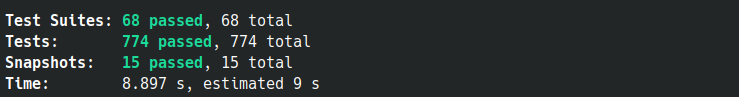

# Types-ddd
---
typescript domain driven design library. All resources tested



## Install

```sh
$ npm i types-ddd

#or 

$ yarn add types-ddd

```

[Full documentation on gitbook.io/types-ddd/](https://alessandroadm.gitbook.io/types-ddd/) or check example folder o source code [Github example](https://github.com/4lessandrodev/types-ddd/tree/main/example)


## DDD (Domain Driven Design)

- [ 1. Ubiquitous language](#1-ubiquitous-language)
- [ 2. Rich domain model](#2-rich-domain-model)
- [ 3. Thin domain service working on rich domain models](#3-thin-domain-service-working-on-rich-domain-models)
- [ 4. Layers in a DDD application](#4-layers-in-a-ddd-application)
- [ 5. Entities](#5-entities)
- [ 6. Value objects](#6-value-objects)
- [ 7. Factories](#7-factories)
- [ 8. Aggregates](#8-aggregates)
- [ 9. Repositories](#9-repositories)
- [10. Shared kernel](#10-shared-kernel)
- [11. Domain events](#11-domain-events)
- [12. Anti-corruption layer](#12-anti-corruption-layer)
- [13. Folders structure](#13-folders-structure)
- [14. Available resources](#14-avaliable-resourses)

> This package provide utils file and interfaces to assistant build a complex application with domain driving design and typescript

## 1. Ubiquitous language:

- Language and terms agreed upon by both business users and developers, within a bounded context
- Entities with the same name in a different context can have different behavior and data
- Bounded context helps in single responsibility for domain models

## 2. Rich domain model:

- Models (entities, value objects, aggregates) with rich behavior are preferred over anemic domain models (entities without behavior, which only keep data and represent the DB tables)
- Due to single responsibility principle (a class or method should have only one reason to change), non-cohesive behavior should be delegated to other classes (or even handled inside domain services) when necessary
- Model methods can also delegate the task to domain services by raising domain events

## 3. Thin domain service working on rich domain models:

- Domain services should not hold state (application services are not domain services, they are on the outer layer close to the UI layer, and can hold application/task state)
- Domain services have very little behavior and only which does not fit cohesively in any domain model
- Domain services sit in the core domain layer along with entities, value objects, aggregates and domain events, and expose domain models in their interfaces

## 4. Layers in a DDD application:

- Core domain layer (domain services, entities, value objects, aggregates and domain events)
- Core domain layer is surrounded by the UI/Application layer and Infrastructure layer
- UI/Application layer (UI and application service facade with messaging, JSON, XML capabilities, session, etc.)
- Infrastructure layer (persistence, file system, network, mail, logging, etc.)

## 5. Entities:

- Live longer than the application, should endure restarts, and are persisted and read from data sources (DB, file system, network, etc.)
- Have an id (preferably a GUID rather than a DB generated int because business transactions do not rely on persistence, can be persisted after other operations carried out in model's behavior)
- Have entity semantics (equality and `GetHashCode()` defined by class name + id)
- Behavior in an entity mostly orchestrates value objects for a use case
- Entity class should not have public property setters, setting a property should be a behavior method
- Entities should not have bidirectional relations (depending on the bounded context, either an egg can have a chicken or a chicken can have eggs, but not both)
- Entity relations should not reflect the complete set of DB foreign key relationships, should be bare down to the minimum for performing the behavior inside the bounded context
- Entity relations should not hold a reference to another entity class, it can only keep the id of another entity
- If a business transaction needs a reference to other entities in relation, aggregates should be used instead (aggregates can hold a reference to other aggregate roots, which are entity classes by definition)

## 6. Value objects:

- Are only identified by their values, not by their ids (for example money is a value object as long as we are not tracking individual banknotes, if we need to track individual banknotes then it should be a banknote entity)
- Can be used to measure or describe things (name, description, amount, height, date, time, range, address, etc.)
- You can combine other value types that usually go together into a new value object type, like address (city, street, country, postal code) or ...range, or ...type
- Prefer to put the behavior on value objects rather than on entities because value objects are immutable and do not have side effects (like changing their state or changing the state of any entity)
- Can be part of an entity
- Have value semantics (equality and `GetHashCode()` defined by property values)
- Should be immutable, behaviors should not change the state of a value object, but can rather create a new value object (should act similar to C# strings, structs, ints, and other value types)
- Can be persisted but only as part of an entity, not individually

## 7. Factories:

- Create, build aggregates and entities:
- Static Create...() factory method on a model class is used to guard against the construction of an invalid or incomplete model
- The model class should not have a public default constructor (however if it is to be persisted, for Entity Framework to work, it can have a protected or private default constructor)

## 8. Aggregates:

- Encapsulate and are composed of entity classes and value objects that change together in a business transaction
- Aggregates are a transactional graph of model objects
- Aggregate root should be an entity, an aggregate can even be a single entity
- Aggregate can keep a reference to other aggregate roots, but not to other entity classes which are not aggregate roots themselves
- Aggregate should not keep a reference to other aggregate root entity classes if those other entities do not change together with this aggregate root entity
- Aggregate can also keep the id of another entity, but keeping too many foreign key ids is a code smell (why?)
- If deleting an entity has a cascade effect on the other entities referenced by class in the object graph, these entities are part of the same aggregate, if not, they should not be inside this aggregate

## 9. Repositories:

- Persist and read aggregates to/from DB or file system
- Should have an interface close to a collection but should allow only the necessary operations needed for this aggregate (for example an aggregate might not need to be allowed to get updated or deleted)
- Should not be generic (should be specific for the aggregate type)
- Can have specific query methods if needed (like `FindByName()` etc.)
- Do not use lazy loading, instead use eager loading (use Include(...) in Entity Framework), else you can face "N+1 problem"s and excessive number of queries sent to DB
- Can have specific methods that only load some of the columns from a table
- Repository add/update/remove operation should commit to DB by itself (call Entity Framework ...Context.SaveChanges() at the end), because aggregate operations should be ACID transactions
- Repository interface sits inside Core domain layer, but implementations are inside Infrastructure layer
- Repositories are not used inside the domain models (entities, value objects, aggregates)

## 10. Shared kernel:

- Is where cross-cutting concerns or common types shared by all bounded contexts sit (like entity abstract base type, value object abstract base type, common value objects, authorization, etc.)

## 11. Domain events:

- Can be raised when a state change occurs in an entity
- Decouple models from each other
- Only used when an event needs to be handled inside a different model than the one raising this event, or handled inside a domain service or even an application service
- Are immutable classes, that represent past, named in the past tense, and cannot change (...Changed, ...Happened, etc.)
- Should include the time that this event was raised, as well as any other useful info for handling the event, as well as the id of the entity which raised the event
- Should not have behavior
- Domain events are subscribed to with a callback (lambda), or using pub sub interfaces, on a singleton or static event message bus
- Domain events implemented this way can be subscribed to and handled in the aggregate root of the entity which raised the event, or in domain services, or even in UI/Application layer
- Domain events are raised synchronously, if an asynchronous task needs to be carried out, it can be done inside the event handler (async-await pattern)
- Outside applications can also be triggered by using a message queue or an enterprise service bus (ESB) inside the domain event handler

## 12. Anti-corruption layer:

- Used to translate models from outside systems or legacy apps to models inside the bounded context and vice versa, and also to ease the communication with legacy services
- Can use service facades and model adapters

## 13. Folders structure

Folders structure suggestion
Divided by

- Domain layer
- Application layer
- Infra layer

```shell
  $ tree
  .
  ├── package.json
  ├── README.md
  └── src
       ├── config
       │    ├── main.ts    
       │    └── env.ts 
       │
       └── modules
            │ 
            └── [module-name]
                  │ 
                  │── domain
                  │     ├── value-objects
                  │     ├── entities
                  │     ├── aggregates
                  │     ├── events
                  │     ├── subscriptions
                  │     ├── repo
                  │     └── services
                  │ 
                  ├── application
                  │     └── use-cases 
                  │ 
                  └── infra
                        ├── models     
                        ├── repo
                        └── mappers 

```

### Module generator

you might also like this tool.

[Module Generator](https://github.com/4lessandrodev/types-generator)
## 14. Available resources

Resources on this lib (Core)

- AggregateRoot
- BaseDomainEntity
- Entity
- ReadList
- Result
- UniqueEntityID
- IUseCase
- ValueObject
- WriteList
- IBaseConnection
- IBaseRepository
- BaseRepository
- IRepository
- Filter
- IMapper
- TMapper
- IDomainEvent
- DomainEvents
- IHandle
- DomainId
- ShortDomainId
- ChangesObserver
- AutoMapper

---

### Value Object

Use value object as attributes for domain entity

```ts
import { ValueObject, Result } from "types-ddd";
```

```ts
interface Prop {
    value: number;
}
```

```ts
class AgeValueObject extends ValueObject<Prop> {
  
  private constructor(prop: Prop) {
      super(prop);
  }

  get value(): number {
      return this.props.value;
  }

  static isValidValue(value: number): boolean {
      // Your logic to validate value
      // must be positive and less than 131 years old
      return value >= 0 && value <= 130
  }

  public static create(value: number): Result<AgeValueObject> {

      const isValidValue = AgeValueObject.isValidValue(value);

      if(!isValidValue) {
          return Result.fail("Invalid value for age");
      }

      return Result.ok(new AgeValueObject({ value }));
  }
}
```

---

### Aggregate

Use Aggregate for a root entity on context. Every another entities on context must be embed on aggregate root. Remember there is only one aggregate root by context.

```ts
import { AggregateRoot, BaseDomainEntity, Result } from "types-ddd";
```

```ts
interface Props extends BaseDomainEntity {
    name: NameValueObject;
    age: AgeValueObject;
}
```

```ts
class UserAggregate extends AggregateRoot<Props> {
  
  private constructor(props: Props) {
      super(props, UserAggregate.name);
  }

  get name(): NameValueObject {
      return this.props.name;
  }

  get age(): AgeValueObject {
      return this.props.age;
  }

  public addEvent(domainEvent: IDomainEvent) {
      this.addDomainEvent(domainEvent);
  }

  public static create(props: Props): Result<UserAggregate> {
      return Result.ok<UserAggregate>(new UserAggregate(props));
  }
}
```

---

### Entity

There is a simple entity from a context. It does not dispatch events.

```ts
import { Entity, BaseDomainEntity, DomainId, Result } from "types-ddd";
```

```ts
interface Props extends BaseDomainEntity {
    color: ColorValueObject;
    year: YearValueObject;
    weight?: WeightValueObject;
}
```

```ts
class Car extends Entity<Props> {
  
  private constructor(props: Props) {
      super(props, Car.name);
  }

  get color(): ColorValueObject {
      return this.props.color;
  }

  get year(): YearValueObject {
      return this.props.year;
  }

  get weight(): WeightValueObject | undefined {
      return this.props.weight;
  }

  private hasRequiredProps(): boolean {
      return !this.checkProps(['color', 'year']).isSome('undefined');
  }

  private isValidYearForCar(year: YearValueObject): boolean {
      return year.isOnRange({ min: 1920, max: 'currentYear' })
  }

  public static create(props: Props): Result<Car> {

      // Your business validation logic
      // You may use rules before return a entity instance
      const car = new Car(props);

      // Example: Required props must be provided 
      const hasRequiredPros = car.hasRequiredProps();

      if (!hasRequiredPros) {
          return Result.fail<Car>("Required props: year and color");
      }

      // Example: Year must be on range 1920 ~ currentYear
      const isValidYearForCar = car.isValidYearForCar(props.year);

      if (!isValidYearForCar) {
          return Result.fail<Car>("The car is so wreck. Invalid year" );
      }

      return Result.ok<Car>(car);
  }
}

```

### How to use

* value-object
* entity

> Aggregate follow the same entity example

If you want to see a full example check the repository [Click here](https://github.com/4lessandrodev/simple-ddd-app-example)

```ts

const clientCode = () => {
  
      // generate a new domain id
      const newID = DomainId.create();


      // create value objects 
      const colorBlackOrError = ColorValueObject.create('BLACK');
      const manufactureYearOrError = YearValueObject.crete(2001);

      // important validate your value objects before use them
      const result = Result.combine([colorBlackOrError, manufactureYearOrError]);

      const isValueObjectsOk = result.isSuccess;
      // only execute next step if all value objects are ok

      const colorBlack = colorBlackOrError.getResult();
      const manufactureYear = manufactureYear.getResult();

      const myCarOrError = Car.create({
          ID: newID,
          color: colorBlack,
          year: manufactureYear
      });

      const isMyCarOk = myCarOrError.isSuccess;
      // only execute next step if car entity is ok

      const myCar = myCarOrError.getResult();

      // Get a persistence object from domain instance to save on database
      const carModel = myCar.toObject();

      console.log(carModel);
      `{ 
          id: "143150b2-47b6-4d97-945b-289f821c7fb9", 
          color: "BLACK", 
          year: 2001,
          isDeleted: false,
          createdAt: "2022-02-13T05:41:32.652Z",
          updatedAt: "2022-02-13T05:41:32.652Z"
      }`

}

```

---

### Check a full example 

A project is available on link below

[Project App Example](https://github.com/4lessandrodev/simple-ddd-app-example)

### Documentation

[Full documentation on gitbook.io/types-ddd/](https://alessandroadm.gitbook.io/types-ddd/)

## Utils

We understand that it's a little repetitive to create some "value-objects" and that's why we provide some "value-objects" that are usually always default
#### Ready to use

- ✔ EmailValueObject
- ✔ UserNameValueObject
- ✔ BirthdayValueObject
- ✔ CurrencyValueObject
- ✔ PasswordValueObject
- ✔ HomePhoneValueObject
- ✔ MobilePhoneValueObject
- ✔ TrackingCodeValueObject
- ✔ RGBColorValueObject
- ✔ HEXColorValueObject
- ✔ PostalCodeValueObject
- ✔ UrlValueObject
- ✔ OrderStatusValueObject
- ✔ PinValueObject
- ✔ CPFValueObject
- ✔ CNPJValueObject
- ✔ CustomStringValueObject
- ✔ CustomNumberValueObject
- ✔ WeightUnitValueObject
- ✔ UnitOfMeasureValueObject
- ✔ DimensionValueObject
- ✔ WeightValueObject
- ✔ DateValueObject
- ✔ getUndefinedKeysAsArray
- ✔ getUndefinedKeysAsObject
- ✔ removeUndefinedKeysFromObject
- ✔ SpecificationComposite
- ✔ State
- ✔ FactoryMethod

> If you have some value object suggestion todo, open an issue on [Github](https://github.com/4lessandrodev/types-ddd/issues)

### Just import and use it - Password

```ts

import { PasswordValueObject } from 'types-ddd';

const passOrError = PasswordValueObject.create('my-strength-pass');
const isValid = passOrError.isSuccess;

console.log(isValid);
> true

const pass = passOrError.getResult();
pass.encrypt();

console.log(pass.value);
> "$2a$12$AdLoTarjC5wnc1tAUc3j1.RczGxxImH0mG6dZkS5zPaGrTi/EmPWG"

console.log(pass.isEncrypted());
> true

const passMatch = pass.compare('my-strength-pass');

console.log(passMatch);
> true

console.log(PasswordValueObject.generateRandomPassword(12));
> "WtS65$@!A6by"

```

### Generate short or normal uid from domain - uuid v4
> repeating a value is unlikely with 16 characters or more

Has been tested to create 90,000 short ids per second and no repeats were generated.

```ts

import { DomainId, ShortDomainId } from 'types-ddd';

const ID = DomainId.create(); // 3x faster than uuid lib

// Do you want to know if a new id was created?

console.log(ID.isNew);
> true

console.log(ID.uid);
> "461235de-ec04-48aa-af94-31fbfa95efcf"

console.log(ID.toShort());
> "31fbb4859e3301fg"

console.log(ID.toShort(18));
> "31fbb4859e3301fcfe"

// Short id. default 16 bytes
const SID = ShortDomainId.create();

console.log(SID.uid)
> "4859eec0123595ef"

```


### Just import and use it - Date


> Easy date manipulation

```ts

import { DateValueObject } from 'types-ddd';

const currentDate = new Date();

const myDate = DateValueObject.create(currentDate).getResult();

console.log(myDate.value);
> "2021-10-11T14:45:04.758Z"

console.log(myDate.format("DD-MM-YYYY"));
> "11-10-2021"

myDate.addDays(3);

console.log(myDate.value);
> "2021-10-14T14:45:04.758Z"

const isWeekend = myDate.isWeekend();

console.log(isWeekend);
> false

myDate.addHours(7);

const isAfter = myDate.isAfter(currentDate);

console.log(isAfter);
> true

```

### Just import and use it - Currency

> Safe value object to calculate finance values.
> Each operation return an instance of Result cause It validate safe number

```ts

import { CurrencyValueObject } from 'types-ddd';

const myCurrency = CurrencyValueObject.create({
    currency: 'BRL', 
    value: 0.50 
}).getResult();

console.log(myCurrency.value);
> 0.5

myCurrency.add(0.50); // 1
myCurrency.multiplyBy(50); // 50
myCurrency.divideBy(2); // 25
myCurrency.subtractBy(5); // 20
myCurrency.add(80); // 100
myCurrency.addPercent(2); // 102
myCurrency.subtractBy(2); // 100
myCurrency.subtractPercent(30); // 70

console.log(myCurrency.value);
> 70

console.log(myCurrency.getCurrencyString());
> "R$ 70.00"

```

### Just import and use it - Result Observer

> You may combine CurrencyValueObject to ChangesObserver
> Observer check all received Results. If some "Result" is failure It returns false.

Imagine an use case where you have to execute a lot of steps that return a result and you have to check result step by step. you probably thought to use a lot of if condition, but "changes observer" may help you with that.

```ts

import { ChangesObserver, Result } from 'types-ddd';

const observer = ChangesObserver.init<string>();

const isAllSuccess = observer
	.add(Result.ok('1'))
	.add(Result.ok('2'))
	.add(Result.fail('fail'))
	.add(Result.ok('4'))
	.isAllResultsSuccess();

console.log(isAllSuccess);
> false

// OR 

const isOK = ChangesObserver.init<string>([ 
    Result.ok('1'),
    Result.ok('2'),
    Result.fail('fail'),
    Result.ok('4')
]).isAllResultsSuccess();;

console.log(isOK);
> false


```

### Just import and use it - Weight units

```ts

import { WeightValueObject } from 'types-ddd';


const valueObjectOrError = WeightValueObject.create({ value: 1000, unit: "TON" });

const isOk = valueObjectOrError.isSuccess;
console.log(isOK);
> true

const valueObject = valueObjectOrError.getResult();

console.log(valueObject.unit);
> "TON"

console.log(valueObject.weight.value);
> 1000

// Convert instance value and unit to KG
valueObject.toKG();

console.log(valueObject.unit);
> "KG"

console.log(valueObject.weight.value);
> 1

```

## Mappers with Factory Method 

Basically the mapper receives a dto and returns a result of an aggregate

```ts

import { State, TMapper, FactoryMethod, Result, DomainId } from 'types-ddd';

// Dto interface
interface CreateUserDto {
    name: string;
    age: number;
}
```

```ts
// factory method

// Mapper concrete implementation of TMapper (Adapter)
class UserToDomainMapper extends State<CreateUserDto> implements TMapper<CreateUserDto, UserEntity> {

    // input persistence instance
    map ( dto: CreateUserDto ): Result<UserEntity> {

        // start a new state
        this.startState();

        // add value objects on state
        this.addState( 'age', AgeValueObject.create( dto.age ) );
        this.addState( 'name', NameValueObject.create( dto.name ) );

        // check if has errors
        const result = this.checkState();
        if ( result.isFailure ) {
          return Result.fail( result.error );
        }

      // output domain entity instance
        return UserEntity.create( {
            ID: DomainId.create(),
            age: this.getStateByKey<AgeValueObject>('age').getResult(),
            name: this.getStateByKey<NameValueObject>('name').getResult()
        })
    }
}

```

```ts
// Optionally you may use Factory Method
// Mapper creator: Factory to create a mapper instance
class UserToDomainFactory extends FactoryMethod<CreateUserDto, UserEntity> {
  protected create (): TMapper<CreateUserDto, UserDomainEntity> {
      return new UserToDomainMapper();
  }
}

```

## Build a domain entity

```ts
// dto instance
const dto: CreateUserDto = {
    age: 18,
    name: 'Neo'
}

// Create a factory instance
const entityFactory = new UserToDomainFactory();

// Use Domain Entity to build a instance from dto > return a result of Domain Entity
const userEntity = UserEntity.build(dto, entityFactory).getResult();

// OR

// Optionally you also may provide a mapper instance instead factory method one
const userMapper = new UserToDomainMapper();
const userEntity = UserEntity.build(dto, userMapper).getResult();

```

```ts
// Inverse from domain instance to model > returns a object as model
const model = userEntity.toObject<UserModel>();

// or you may provide your custom mapper

const modelFactory = new UserToModelFactory();

const model = userEntity.toObject<UserModel>(modelFactory);


```
